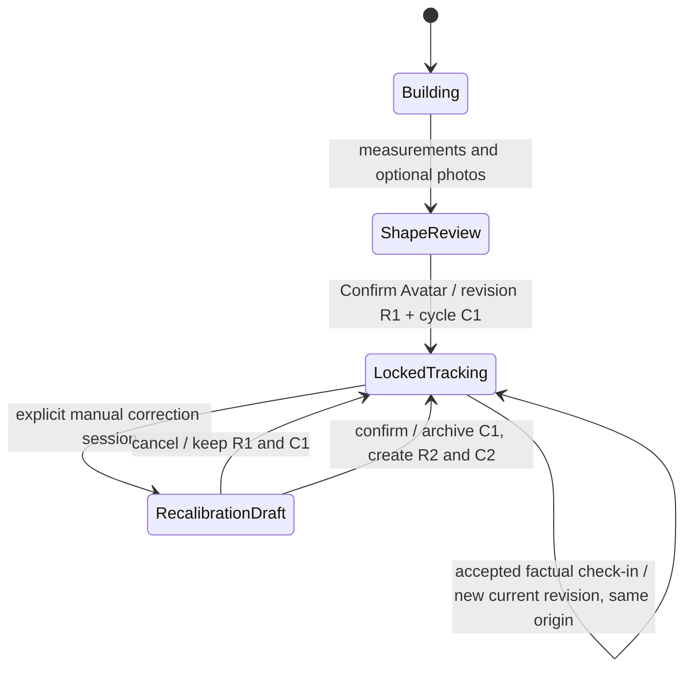
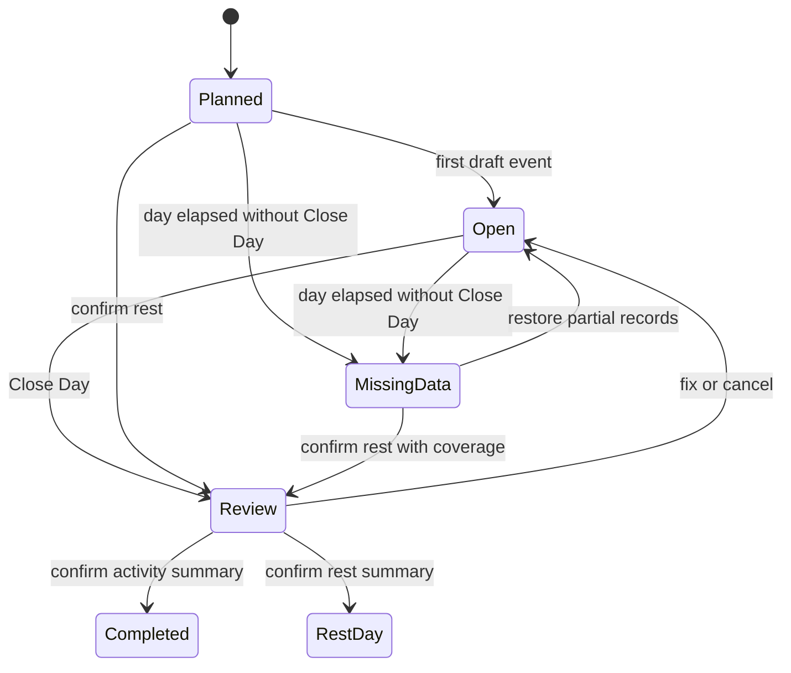
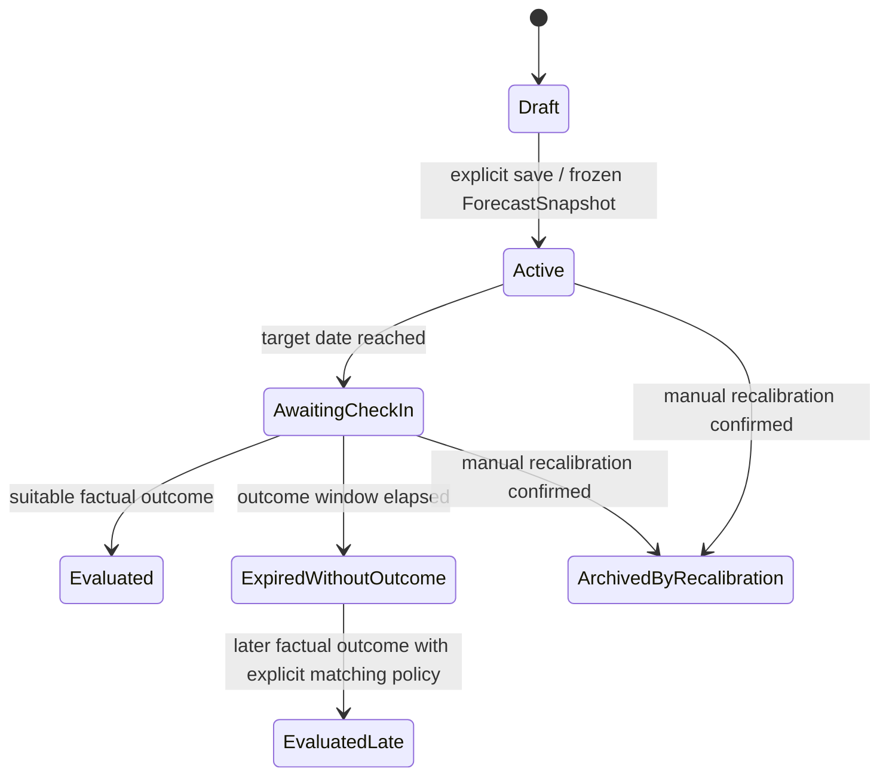

# Канонический lifecycle продукта

**Статус реализации Phase 1 (2026-10-09):** в отдельном implementation PR добавлены Profile/Avatar, immutable revisions, corrections/AvatarDerived, lock/recalibration, automatic-photo API, additive migration и backup. Контракты и ограничения — [AVATAR_DOMAIN](AVATAR_DOMAIN.md). TrackingCycle пока представлен origin/cycle IDs и событиями, RecalibrationSession — AvatarDraft. Остальные фазы ниже остаются целевой спецификацией; полноценный Hypothesis lifecycle и photo UI wiring не реализованы.

Статус: **целевая продуктовая спецификация**, 2026-10-09; не описание уже реализованных функций. Этот документ имеет приоритет при определении поведения продукта. [Roadmap](PRODUCT_LIFECYCLE_ROADMAP.md) задаёт порядок реализации, [технологические решения](PRODUCT_TECHNOLOGY_DECISIONS.md) — инструменты, [PRODUCT_STRUCTURE](PRODUCT_STRUCTURE.md) — карту текущего приложения и перехода, [VALIDATION](VALIDATION.md) — проверки. Формулы и исследовательские gates остаются в [Forecast v3 R&D](FORECAST_V3_RND_PLAN.md).

Канонический маршрут: **Profile → создание Avatar → визуальная коррекция → Confirm/Lock → ActivityDay → Close Day → явное создание Hypothesis на 14/30 дней → необязательный endpoint Render → CheckIn → Forecast vs Fact → следующая Hypothesis**.

Фоторендер — редкая визуализация гипотезы. Основная ежедневная работа — календарь, факты питания и активности. Автономный coach, mental UX, backend и новые большие модели не входят в этот документационный этап.

## 1. Словарь и ownership

Названия ниже — будущие доменные контракты, а не обещание наличия одноимённых классов. IDs стабильны; ссылки указывают на конкретную revision, а не только на изменяемое «текущее» состояние.

| Сущность | Ответственность и минимальные связи |
|---|---|
| `Profile / Account` | Системная идентичность, настройки, часовой пояс, согласия; `activeAvatarId`. Профиль не является телом. В v1 один активный Avatar; хранение допускает историю и несколько Avatar без вечного ограничения 1:1. |
| `Avatar` | Идентичность цифрового тела; `profileId`, `currentRevisionId`, статус создания. Геометрия хранится в revisions. |
| `AvatarRevision` | Неизменяемая версия геометрии: parent, причина, BodySnapshot/photo refs, correction/derived refs, mesh hash/artifact, fitter/morph versions, confidence, время создания. |
| `AvatarShapeCorrectionProfile` | Версионированный набор семантических поправок формы с автором/временем, base revision, диапазонами controls и версией morph layer. Не таблица ручных сантиметров. |
| `AvatarDerivedMetrics` | Измерения и признаки **геометрии**, маркированные `AvatarDerived`: mesh girths, отношения, объёмы/распределение, proxies, единицы, методы/версии и confidence; ссылка на точную AvatarRevision. |
| `BodySnapshot` | Частичное наблюдение тела на дату: только известные значения и источники по полям, ссылки на реальные фото. Measured, imported и PhotoDerived различаются. Не контейнер синтетических исходов. |
| `TrackingCycle` | Необходимая связующая сущность: `originAvatarRevisionId`, начало/конец, причина закрытия, активные Hypothesis. Origin неизменяем, current revision может обновляться фактами. |
| `AvatarRecalibrationSession` | Изолированный draft ручной перенастройки с причиной, base revision, preview и явным commit/cancel. Подтверждение создаёт новый tracking origin. |
| `DailyPlanTemplate / DailyPlan` | Настройки повторяемого дня и их копия на конкретную дату: meals, зарядка, mobility, ходьба/кардио, силовая, свободные slots. Только expectation. |
| `ActivityDay` | День календаря профиля: `localDate`, сохранённый timezone, plan revision, draft events, day state и ссылка на закрытую revision. Дата, а не номер «9», является ключом. |
| `ActivityEvent` | Общая оболочка события: kind, время/дата, источник, stable ID, link на cardio/strength payload либо nutrition/mobility payload, единицы, draft revision. Не копия workout engine. |
| `ClosedActivityDay` | Подтверждённая версия дня: замороженные plan/events/totals, coverage неизвестных полей, outcome Completed/RestDay, evidence cutoff, расчётные версии, hash, ссылки/снимки underlying workouts. |
| `Hypothesis` | Явно сохранённая versioned гипотеза продолжения наблюдаемого режима на 14 или 30 дней: origin/cycle, evidence set, maturity/gate decision, assumptions, точная target date, ForecastSnapshot и outcome status. |
| `ForecastSnapshot` | Immutable расчёт: входы, версии/коэффициенты/calibration, uncertainty, сохранённые numeric points и target geometry/artifact. Replay читает сохранённый результат. |
| `CheckIn` | Запись результата наблюдения: observedAt/recordedAt, частичный BodySnapshot, реальные фото, quality; связь с Hypothesis и оценкой доступных полей. |
| `Render` | Визуализация одной конечной точки: forecast/target hash, source photo/revision, ракурс, provider/settings/seed, maps, consent, validation result, стоимость/попытки. Никогда evidence. |

Связи: Profile → Avatar → AvatarRevision; TrackingCycle → origin revision; ActivityDay → ClosedActivityDay revisions; Hypothesis → frozen evidence + ForecastSnapshot; CheckIn → BodySnapshot → новая AvatarRevision; Render → immutable forecast endpoint.

## 2. Разделение источников истины

| Слой | Примеры | Допустимое применение |
|---|---|---|
| Factual observations | Введённый вес/обхват с методом, реально снятая фотография, подтверждённая запись еды/тренировки | BodySnapshot, ClosedActivityDay, CheckIn. Self-report остаётся self-report, не лабораторной истиной. |
| Estimates / `PhotoDerived` | Фотооценка обхвата, ANSUR fallback, expenditure, оценочный BF% | Восстановление, прогноз с uncertainty; происхождение и метод обязательны. Снимок — наблюдение, алгоритмическая интерпретация снимка — оценка. |
| `AvatarDerived` | Mesh girth, shoulder/waist ratio, regional volume, visual leanness proxy | Дополнительные model inputs/priors после validation. Не factual BF%, не кг мышц. |
| Forecast | Будущий вес, fat/lean, обхваты, адаптация, future mesh | Проверяемая гипотеза с диапазонами и сохранённым origin. |
| Render | Local warp или AI future photo | Только иллюстрация сохранённого прогноза. Не BodySnapshot, не calibration label. |

Существующие `SnapshotSource.Photo` / `MeasurementMethod.PhotoDerived` сохраняют совместимость, но не делают вывод алгоритма ручным измерением. `BodySnapshot.BodyForm/Posture` в legacy также требуют сохранения исходной семантики, а не автоматического повышения до объективного факта. `BodyProfile` остаётся вычислительным DTO до отдельной миграции; это не новый Account.

Каждая оценка должна различать `observedAt`, `recordedAt`, `computedAt` и версии источника. Для origin доступны только записи, уже известные на момент его создания: поздно внесённый вчерашний день не существовал во вчерашнем прогнозе. Не считать несколько признаков из одного фото независимыми подтверждениями; больше качественных данных может повышать confidence, но дубликаты и противоречия — нет.

## 3. Создание Avatar

После создания системного Profile отдельно создаётся Avatar. Входы: пол, возраст/дата рождения, рост, вес; optional известный % жира и ручные обхваты; optional front/side/back photos, photo-derived параметры. Неизвестные значения остаются null. Текущий MakeHuman/skeleton/atlas/fitter строит базовую геометрию, маркируя completion estimates.

Обязательный экран после reconstruction показывает текущий 3D Avatar и сообщение:

> Модель может отличаться от вашего реального телосложения. Точность исходного Avatar влияет на точность дальнейших прогнозов. Скорректируйте форму, если она отличается от вашей.

Рядом — источники, недостающие входы и confidence с объяснением, без обещания гарантированной точности. Пользователь может пропустить фото, но не обязательный просмотр/подтверждение Avatar.

### Семантическая коррекция

Controls: плечи уже/шире, живот, бока, грудь, ягодицы, руки, ноги, общая визуальная сухость/полнота; дополнительные controls только в безопасных пределах morph layer. Это отдельный `AvatarShapeCorrectionProfile` поверх автоматического fit.

- Factual measurements не меняются ни при preview, ни при Confirm.
- После Confirm поправки входят в рабочую геометрию. Mesh measurements сохраняются отдельно как `AvatarDerivedMetrics`.
- Если shape control конфликтует с замерами, показать residual и uncertainty; ограничить недопустимую геометрию. Исправить реальный замер можно только отдельным явным действием, а не движением shape slider.
- Безопасность: finite coordinates, отсутствие недопустимых складок/self-intersections, ограничения суставов/силуэта и согласованность масштаба. Не компенсировать ошибку веса вымышленной мышечной массой.
- Сохранить базу fit, correction profile, итоговый mesh и versions для воспроизводимости. Алгоритм повторной подгонки не должен незаметно уничтожать подтверждённую коррекцию.

`Confirm Avatar` атомарно создаёт первую locked AvatarRevision и TrackingCycle. В обычных экранах sliders формы отсутствуют. Поворот камеры, анимация и heatmap разрешены: они не меняют rest geometry или tracking origin.

### Исследовательские признаки формы

Из итоговой геометрии можно исследовать shoulder-to-waist ratio, regional volume distribution, visual leanness, likely training status/muscularity и shape residual относительно population prior. Субъективная ручная коррекция может отражать ожидания пользователя; эти признаки не являются независимой истиной.

До использования для production claims нужны независимые измерения, participant-held-out validation, разбор ошибок по типам тел/позе/одежде, ablation measurements-only / +photos / +manual corrections и проверка calibration/uncertainty. «Нет боков» не доказывает низкий BF% или определённую тренированность. При невалидированном proxy показывать только исследовательскую оценку либо не использовать его в production model.

## 4. Lock, revisions и recalibration

| Событие | Что меняется | Что сохраняется |
|---|---|---|
| Начать recalibration | Отдельный draft с причиной: исходная ошибка / визуальное уточнение / ручная перестройка после новых данных. На время сессии создание новых гипотез приостановлено. | Действующий cycle и Avatar до commit; draft активности можно продолжать. |
| Отменить | Draft закрывается без новых revisions. | Старый origin и гипотезы. |
| Подтвердить | В одной транзакции: archive current cycle; активные Hypothesis → `ArchivedByRecalibration`; новая AvatarRevision, новый TrackingCycle и origin. | Все старые facts, revisions, forecasts, validation results и renders; архив доступен. |
| Принять factual photos/check-in | Pipeline автоматически создаёт новую revision с причиной `FactualUpdate` и обновляет current pointer после quality gate. | Тот же TrackingCycle.origin; уже сохранённые Hypothesis/ForecastSnapshots. |
| Низкое качество фото | Сохранить observation и quality/failure reason, удержать последнюю надёжную геометрию или ограниченный fallback; расширить uncertainty. | Рабочая модель не заменяется плохим fit. |

**Lock ограничивает ручное произвольное изменение, а не поступление новых наблюдений.** Origin цикла фиксирован; current observation revision развивается. Каждая новая Hypothesis фиксирует ту current revision, которая была известна при её создании, вместе с cycle origin. Старая Hypothesis продолжает сравниваться со своими исходными данными.

Фотографии не требуют подтверждения каждого движения вершин. Требуются provenance (`BodySnapshot`/photo session, parent revision, fitter version, confidence, hashes) и автоматическая проверка результата. Новый fitter не переписывает исторические meshes. Refit новой фотографией использует прежние corrections только как versioned prior, не применяет их повторно как накопительный delta.

Photo-only check-in допускается как наблюдение со ссылками на фото и пустыми measured fields. Сейчас `BodySnapshot.Validate()` требует хотя бы одно значение/форму: Phase 1/6 должны расширить контракт или хранить observation envelope, не вставляя фиктивный вес/BF% ради валидатора.

Новый цикл не стирает прежние дни. Behavioral history может использоваться новым origin при явно сохранённом evidence window и допустимой давности; shape residual/calibration через ручной reset нельзя переносить как доказательство физических изменений. Совместимость calibration по composition/shape version и границе reset проверяется отдельно. Recalibration сама по себе не является outcome.

## 5. Непрерывный ActivityDay

После Confirm стартовый рабочий экран — **Активность / сегодня**. Day 9 означает 9-е число текущего месяца, а ключ хранит полную дату. Пропущенные даты остаются в календаре. Часовой пояс дня фиксируется при создании; смена timezone не передвигает закрытую историю. UTC timestamp и local date сохраняются вместе, включая переходы через полночь.

`Planned/Open` означает рабочую группу: `Planned` — создана копия шаблона, `Open` — идёт заполнение. Оба состояния исключены из behavioral forecast evidence.

| Состояние | Семантика | Forecast evidence |
|---|---|---|
| Planned / Open | План и все фактические записи пока draft | Нет |
| Completed | Пользователь прошёл review и Close Day | Только связанная подтверждённая ClosedActivityDay revision, с coverage |
| RestDay | Пользователь явно подтвердил отдых, прошёл Close Day; питание и бытовая активность могут быть | ClosedActivityDay с rest outcome; отдых не означает нулевой расход или нулевую еду |
| MissingData | День не закрыт, данных нет или статус ещё не выяснен | Нет fabricated behavior; gaps учитываются в uncertainty/confidence |

Review — состояние процесса, не пятый завершённый day outcome. Утром/при следующем входе незакрытый день запрашивает: «День отдыха», «Активность была — заполнить», «Данных нет». Неотвеченный запрос оставляет MissingData; он не блокирует ввод сегодня. Draft записи сохраняются для восстановления.

### Plan и ActivityEvent

Template копируется в DailyPlan; изменения настроек влияют на будущие дни. Сегодняшний draft можно перестроить явно; закрытый план сохраняется для сравнения. Пропущенный слот не превращается в выполненное событие, а поздняя еда не становится нарушением состава тела.

ActivityEvent v1 поддерживает `CardioWalking`, `Strength`, `MobilityStretching`, `SpontaneousExercise`, `Nutrition`. Примеры: растяжка 8 минут, ходьба 10 км, мини-сессии приседаний/отжиманий, вечерняя силовая, реальные meals. Existing cardio/TrainingSession — источник workout payload; общий слой связывает их с днём, не создаёт второй журнал тренировок. Стабильные source IDs и revision предотвращают двойной учёт одной прогулки/силовой, включая импорт и мини-сессии. Классифицированное как strength событие не учитывается ещё раз как spontaneous.

Future kinds meditation/journal/sleep/mental training допустимы через schema/capability extension. Сейчас нет их UI, inference, scoring или отдельных production моделей; неизвестный future kind сохраняется при backup, но не передаётся молча в body forecast.

## 6. Nutrition v1 — ручные КБЖУ и масса

Позиция: название, basis (`Per100g` или `StandardServing`), standard grams, kcal/protein/fat/carbs в выбранном basis, actual grams, optional meal time. Kcal — ккал, P/F/C — граммы. Сохранять исходные значения и нормализованный итог; округлять для отображения, суммировать без промежуточного округления.

`factor = actualGrams / basisGrams`, где basisGrams = 100 либо масса стандартной порции; каждое из kcal/P/F/C умножается на factor.

| Пример «Макароны по-флотски» | Масса | kcal | Protein | Fat | Carbs |
|---|---:|---:|---:|---:|---:|
| Стандартная порция (пример ввода, не справочник) | 350 г | 600 | 30 г | 20 г | 75 г |
| Реально съедено | 175 г | 300 | 15 г | 10 г | 37.5 г |

Basis должен быть положительным и finite; actual grams — finite и неотрицательным, нулевая позиция не считается приёмом еды. Отрицательные/NaN/Infinity отклоняются. Пустое поле означает неизвестно, не 0; draft с неполными макросами явно помечается. Close Day сохраняет coverage питания; отсутствующий meal не превращается в голодание. Несогласованные kcal и P/F/C показать пользователю до подтверждения; адаптер Stage A использует согласованный versioned validation policy, не исправляя фактический ввод скрытно.

Для полных/частичных/отсутствующих макросов forecast adapter применяет документированный fallback Stage A. Неизвестные данные не заполняются «идеальной» тарелкой. Сохранение блюда готовит ссылку на будущий personal dictionary, но closed entry хранит значения порции: правка будущего рецепта не меняет прошлое питание.

Meal time — организационный параметр. Перенос завтрака с 06:00 на 09:00 при тех же totals не должен сам менять body composition, ставить штраф или общий `food quality 73/100`. Показывать конкретные kcal, P/F/C, полноту данных и сравнение с планом. Позже: saved dishes, ingredients/recipes, food DB/barcodes через адаптер; внешняя nutrition API не нужна v1.

## 7. Close Day и исправления

Процесс: **review → исправления → расчёт summary → явное подтверждение → атомарная ClosedActivityDay revision**. До последнего шага записи редактируемы. Повтор клика/перезагрузка/повтор запроса с тем же idempotency key не создают второй факт. CAS по draft revision не допускает закрытия устаревшей вкладки.

В summary входят consumed kcal и P/F/C; estimated activity expenditure; energy balance/range; walking/cardio; выполненный strength volume; muscle load heatmap на Avatar; training load; completed vs planned; coverage и missing fields; конкретные nutrition metrics; advisory notes на следующий день.

Energy balance = intake минус **total expenditure** (resting/activity/TEF по выбранной версии модели), а не только calories тренировки. Диапазон отражает неопределённость; бытовую активность, часы и workout нельзя складывать дважды. Если intake или расход недостаточно известны, баланс неизвестен/частичен — не точный дефицит. Heatmap показывает оценку нагрузки, не измеренный рост мышцы.

`ClosedActivityDay` — immutable-ish на уровне UX, **append-only по версиям**: исправление создаёт новый draft и затем superseding closed revision с причиной. Старые revisions и их payload остаются. Изменение linked TrainingSession после закрытия не меняет frozen day; пользователь явно выполняет amendment. Удаление в текущем журнале сохраняет archive/tombstone, необходимый replay. Старые Hypothesis используют исходную revision, новые — последнюю доступную на дату origin. Статус отменённого/исправленного evidence виден в accuracy audit.

Confirmed RestDay без полного питания может давать подтверждение отсутствия тренировки, но не полные nutrition evidence. «Количество closed days» само по себе не заменяет coverage gate. Gaps MissingData учитываются как отсутствие сведений и расширяют uncertainty, а не как нулевая активность.

## 8. Hypothesis: origin, maturity и endpoint

Hypothesis создаётся только явным действием пользователя. DailyPlan и открытые события не поступают в evidence aggregator. Для behavioral evidence допустимы только ClosedActivityDay revisions; для состояния тела — factual CheckIn/BodySnapshot с источниками. AvatarDerived — отдельные priors, не новые факты. Существующие сохранённые plan scenarios не становятся задним числом наблюдавшейся привычкой.

При сохранении freeze: Hypothesis ID/version, TrackingCycle origin, current AvatarRevision, exact evidence IDs/revisions/coverage, origin time/cutoff, 14/30 calendar days, targetDate, model/calibration/shape/uncertainty versions, assumptions, gate decision, ForecastSnapshot. Нельзя ежедневно молча пересохранять Hypothesis после Close Day. UI предлагает «Создать следующую / новую версию»; прежняя доступна для сравнения.

Горизонт **30 дней не равен 4 неделям**. Текущий engine/архив преимущественно weekly: implementation обязан добавить точную endpoint-оценку и её сохранение с версией либо документированный validated adapter. Не переименовывать 28-дневную точку в 30-дневную и не менять legacy replay.

| Наблюдения в доступном recent evidence window | Maturity | Поведение |
|---|---|---|
| 0–2 closed days | Insufficient | Нет lifestyle-based visual hypothesis; AI future render закрыт. |
| 3–6 closed days | Preliminary | Предварительный прогноз с низким confidence; renderer только при всех дополнительных gates. |
| ≥7 closed days | ObservedRoutine | Прогноз по наблюдавшемуся недавнему режиму; пробелы/coverage всё ещё влияют. |
| 3–5 недель + check-ins | InitialPersonalized | Начальная персональная calibration при пригодных outcome и отсутствии leakage. |
| 6–8+ недель | StrongerPersonalized | Более сильная персонализация при достаточных качественных наблюдениях; длительность сама по себе точность не доказывает. |

Это стартовая продуктовая policy, не эмпирически доказанные thresholds. Версионировать policy; Phase 5 фиксирует recent window/max age и coverage, Phase 8 — numeric photo/Avatar thresholds по benchmark. До validation неизвестный gate трактуется как fail, не как pass.

Даже на 0–2 днях могут быть доступны numerical weight projection с широким диапазоном при достаточных inputs, training/muscle load projection и обычный 3D forecast, если engine допускает сценарий. Они помечены как сценарная оценка с недостаточной историей, не как lifestyle hypothesis. Open daily plan всё равно не является входом; отдельные явные scenario assumptions хранятся отдельно от evidence. Точная UI причина: мало закрытых дней, неполное питание, старые данные, низкое качество Avatar или непригодное фото — вместо общего «ошибка».

## 9. Завершение Hypothesis и CheckIn

Желательный CheckIn: вес, optional manual girths, front/side photos, optional back. Не требовать фото для числового сравнения, не придумывать вес из фото. Partial outcome даёт только доступные сравнения; photo-only не даёт weight/BF accuracy. Если нет пригодного outcome, `ExpiredWithoutOutcome`, accuracy отсутствует, calibration не обучается на выдуманной точке.

Для v1 предлагается outcome window ±3 дня как в нынешнем evaluation: targetDate остаётся точной, фактический offset показывается. Окончательное matching policy/version закрепить Phase 5 до реализации; сохранять выбранный outcome ID и не заменять его молча более удобным результатом. Поздний outcome — отдельная evaluation revision со своим recordedAt; никаких ретроактивных улучшений calibration старых прогнозов. Recalibration session не используется для измерения физиологического прогресса через reset.

При пригодном outcome: Forecast vs Fact, signed/absolute errors и range coverage по каждому известному полю; новая calibration revision только для будущих origin; предложение следующей Hypothesis. Просмотр истории/даты не меняет current facts и не вызывает новый forecast.

## 10. Render: одна конечная точка

Current state = реальные фото + current Avatar. Future photo = гипотетическая визуализация рассчитанного endpoint. **Одна Hypothesis → одна основная точка +14 или +30 дней**; optional front/side — ракурсы той же точки. Нет ежедневных AI renders и timeline из десятков картинок. Повторные технические attempts относятся к той же задаче/target, а не к новым forecast points.

### Eligibility gate

AI render разрешён, только когда одновременно:

1. Hypothesis сохранена, не draft, endpoint соответствует её 14/30 дням.
2. Target ForecastSnapshot immutable, рассчитан и сохранён future mesh/hash.
3. Minimum behavioral evidence gate passed: как минимум preliminary 3+ closed days **и** достаточные recent coverage/качество.
4. Current Avatar confidence и качество source-to-current fit достаточны.
5. Source photo suitability (поза, видимость, ракурс, alignment) достаточна.
6. Provider/model/license/structural validation policy одобрены; для upload получено отдельное согласие.

Gate вычисляется до платного job, сохраняет policy version и причины. Новый source photo не подменяет target: подобрать соответствующую current mesh revision и выровнять с frozen endpoint. Если фото уже не сопоставимо с origin/target, отказать или предложить новую Hypothesis. Gate fail оставляет допустимый 3D forecast, но render disabled с объяснением. Отказ от upload не отключает локальное приложение.

### Provider contract (концептуальный)

`IPhotorealisticRenderer` / общий renderer adapter получает RenderRequest с source photo reference/consent, current fitted mesh, immutable target mesh/maps, camera/pose, Hypothesis/ForecastSnapshot IDs, ракурсом, provider settings и idempotency key. Возвращает job/result, provenance, cost, validation state или typed failure. Secrets и вызовы managed API в будущем находятся на сервере, не в WASM.

| Provider | Роль |
|---|---|
| `GeometryWarpRenderer` | Обязательный local deterministic baseline; общий rendering contract допустим, capability `photorealistic=false`. |
| `ManagedDepthRenderer` | Launch path: managed API с source image + depth/structural conditioning. fal — первый кандидат для benchmark, не утверждённый checkpoint. |
| General image renderer | Optional unconditioned research baseline; не production обход structural gate. |
| `SelfHostedRenderer` | Позднее serverless/собственный GPU worker после business gate. |

`GeometryWarpRenderer`: source photo → current/future meshes в одной camera/pose → projected displacement → barycentric/dense texture warp в Three.js/WebGL (WebGPU optional) → bounded background/silhouette repair → structural check. Стоимость inference $0, данные локальны, результат воспроизводим в пределах числовой tolerance. Не обещать фотореализм, восстановление скрытой текстуры или точность физиологии. Неподдерживаемая поза/occlusion даёт 3D fallback.

AI path: **future mesh → depth/normals/mask/keypoints → managed renderer → structural validator**. Проверять silhouette/width adherence, identity, pose и отсутствие body enhancement сверх target; превышение error → bounded retry того же target или Failed. Непрошедший output не показывается как достоверный результат. Future mesh остаётся source of truth; render не исправляет физиологию. Детали benchmark и выбора поставщика — [технологические решения](PRODUCT_TECHNOLOGY_DECISIONS.md).

### Экономика и backend

200 paying users × 1–2 hypotheses/month дают порядок **200–400 основных endpoint renders**, а не 6000 ежедневных. Дополнительный ракурс и retries учитываются отдельно. При низкой цене managed inference это может быть небольшой частью subscription revenue; это проверяемая бюджетная гипотеза, не гарантия маржи. [Cost model и business gate](PRODUCT_TECHNOLOGY_DECISIONS.md#экономика-и-business-gate) включают rejected attempts, storage, validation и обслуживание.

На старте нет аренды постоянного GPU. Backend в будущем: auth/profile API, database, приватное object storage, очередь jobs, managed provider; GPU worker только позже. В этом этапе backend не реализуется. Local-first facts/3D/warp должны работать без upload. Автоматический план следующего дня — future stage: сейчас template, редактируемые настройки и advisory после Close Day.

## 11. Неприкосновенные acceptance invariants

1. Shape corrections не изменяют factual measurements; derived mesh values маркированы `AvatarDerived`.
2. Locked Avatar нельзя вручную менять без отдельной session; Confirm recalibration = новая revision и новый origin, архив без переписывания.
3. Factual photos могут обновлять current Avatar автоматически только с provenance, revision и quality/fallback.
4. Open/Planned day и mutable event не behavioral evidence; только ClosedActivityDay revision.
5. MissingData не RestDay, unknown не zero; gaps понижают confidence.
6. Nutrition v1 = ручные КБЖУ + serving scaling; meal time не body-composition score.
7. 3+ closed days допускают preliminary forecast с низким confidence, но не гарантируют render eligibility.
8. Hypothesis создаётся явно, origin/evidence/endpoint заморожены; одна конечная точка render.
9. AI render никогда не становится BodySnapshot или calibration evidence; actual photo — вход, generated photo — визуализация.
10. Старые forecasts, Avatar revisions и закрытые revisions replayable; не реконструировать прошлые predictions для prospective accuracy.

## 12. Решения, которые ещё требуют отдельного ADR/benchmark

Продуктовые правила выше уже определены. Открыты технические параметры: schema/transaction layout миграции и photo-only observation (Phase 1/6); morph bounds и residual policy (Phase 2); recent-window/coverage/точный 30-day adapter и late outcome policy (Phase 5); совместимость personalization через recalibration (Phase 5/6); warp occlusion/repair tolerances (Phase 7); numeric structural/identity thresholds, checkpoint/provider/retention (Phase 8); measured break-even/SLO для GPU (Phase 9). До решения соответствующий gate закрыт или используется явно описанный baseline.
