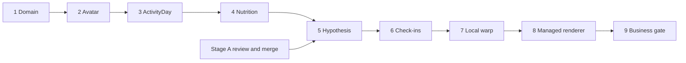

# Roadmap реализации продуктового lifecycle

**Phase 3, 2026-10-09:** реализована от `main 6926da7330792eddf0bdbf56bfdc08035e92f06c` после обычного merge #22 и зелёного CI базы. DayPlan/actual, continuous calendar/today, explicit Completed/RestDay/MissingData, frozen Close Day, reference indexing, movement/spontaneous events, daily load, CAS/backup/export. Контракт и ограничения — [ACTIVITY_DAY](ACTIVITY_DAY.md), результаты — [browser report](evidence/activity-day/report.json). Phase 4–9 остаются планом; #19 не включён. Новый implementation PR не мержится автоматически.

**Обновление Phase 1, 2026-10-09:** domain foundation реализована в отдельном implementation PR от `main 9878994f4a0766f8ea8599c3fbb2b12e355a2701` после merge #20. Phase 2 реализована ниже; Phase 3 обновлена выше. Исходный docs-only статус ниже сохранён как контекст первоначального roadmap.

Статус: план, 2026-10-09. Ни одна фаза не считается выполненной этим docs PR. Канон — [PRODUCT_LIFECYCLE](PRODUCT_LIFECYCLE.md); инструменты — [PRODUCT_TECHNOLOGY_DECISIONS](PRODUCT_TECHNOLOGY_DECISIONS.md); критерии — [VALIDATION](VALIDATION.md). Каждая фаза — отдельная implementation task/PR с явным GO/NO-GO, без автоматического merge.

## Исходная база и совместная работа

Проверенный `main`: `471449780756f091234849d3055bd1e149f9312e` (2026-10-09).

| PR | Состояние при аудите | Что учитывать |
|---|---|---|
| [#17](https://github.com/branch-danya-dev/trening/pull/17) | Merged, merge `9872660` | FORECAST_V3_RND_PLAN уже в main; обновляется тот же документ, без второй копии. |
| [#18](https://github.com/branch-danya-dev/trening/pull/18) | Merged, merge `4714497` | Onboarding, Activity calendar, backup, validation — стартовая реализация, не весь новый lifecycle. |
| [#19](https://github.com/branch-danya-dev/trening/pull/19) | Open, head `62ad4811169d8ea8c3de22247c4ce0712b9c7763` | Stage A composition v3 находится на review. Production code не переносится в docs branch. |

На момент первоначального аудита новых PR #20+ не было. Перед каждой фазой заново прочитать актуальный main и открытые PR. При merge #19 сохранить его composition/benchmark/validation документы и status update; они дополняют lifecycle. Его GO для model agreement не доказывает точность на людях и не закрывает Phase 5/8. Sodium/ECF остаётся research-only. Не переписывать историю и не cherry-pick весь implementation ради документа.

## Общие правила поставки

- Сначала domain contracts/migration, затем UI и downstream consumers. За флагом фазы нельзя обходить immutable facts или восстанавливать старый writer поверх нового storage.
- Каждая storage-фаза: fixture старого архива, backup до миграции, idempotent migration, прерывание/повтор, multi-tab CAS, quota/corruption handling, полноценный backup/restore. Старые данные и numerical ForecastSnapshot points не пересчитываются.
- Domain tests проверяют поведение, не зеркалят реализацию. Browser smoke: desktop, 320×844, 390×844, reload, ошибки, offline опубликованной PWA `/trening/`. Для затронутых фаз включать существующие suites из CI; новые критерии ниже пока не являются существующими тестами.
- До merge: необходимые build/tests/CI, отсутствие регрессии replay, понятные uncertainty/empty states, данные без скрытого upload, обновлённые docs. Физиологические/визуальные claims требуют независимой validation сверх smoke.
- Rollback отключает новую возможность и возвращает совместимый reader/fallback. Не down-migrate с потерей новых данных; неизвестная schema должна блокировать запись старым клиентом.

Порядок — продуктовый. R&D BodyParts3D/DeltaShape остаётся отдельной веткой исследований по [Forecast v3](FORECAST_V3_RND_PLAN.md), не обязательной блокировкой календаря/питания. Малые PR внутри фазы допустимы, но следующий публичный capability открывается только после acceptance зависимостей.

## Phase 1 — Domain foundation

**Реализация:** [AVATAR_DOMAIN](AVATAR_DOMAIN.md). Разделены Profile/Avatar collections в atomic CAS envelope; добавлены immutable revisions, visual corrections, final-mesh metrics/quality, draft/lock/recalibration, durable cycle events и automatic-photo service. Сохранены BodySnapshot/ForecastSnapshot history и legacy before-images. Full backup включает домен; validation export opt-in/pseudonymized. UI: confirm/lock, отдельная коррекция, history/status.

**Known debt Phase 2:** polished создание/review, photo UI wiring, независимые flank/muscularity controls, эмпирическая confidence и визуальная точность. Пока manual reset требует явного старта нового forecast cycle; legacy plan scenarios не объявлены новым Hypothesis lifecycle. Управления несколькими Avatar нет. При первой смене fitter/asset потребуется совместимый versioned replay. Ниже сохранены исходный scope и acceptance для трассировки.

**Результат:** система различает Profile, тело, рабочий origin, наблюдения и версии; migration сохраняет старую историю.

**Domain/API.** Спроектировать Profile/Avatar IDs, AvatarRevision, AvatarShapeCorrectionProfile, AvatarDerivedMetrics, TrackingCycle и RecalibrationSession. Команды `BeginRecalibration`, `ConfirmRecalibration`, `CancelRecalibration` с expected revision/idempotency key. У Profile один active pointer, не вечный 1:1. Origin immutable; future factual updates отдельно от manual reset. Закрепить units, timestamps, provenance и schema versions. `BodyProfile` оставить вычислительным DTO; auth API пока не нужен.

**UI.** Разделить системные настройки и данные тела; обозначить legacy imported/unconfirmed state. Спроектировать locked/read-only режим и review последствий recalibration. Не объявлять старую визуальную настройку измеренным фактом.

**Storage/migration.** Инвентаризировать `workoutcalc.*` localStorage, strict stores/CAS и IndexedDB photos по [BACKUP](BACKUP.md). Создать mapping legacy IDs → Profile/Avatar/revisions. `BodySnapshot` сохранить с исходными значениями, PhotoDerived methods, form/posture provenance; imported legacy `BodyProfile` не превращать в Manual snapshot без подтверждения. Сохранить `SavedHypothesis/StoredHypotheses` как legacy plan scenarios, ForecastSnapshots как архив с прежним origin. Не создавать из журналов fictitious ClosedActivityDays. Продумать photo-only observation без заполнения обязательных полей фиктивными значениями. Миграция additive и восстановимая; записать схему staging/commit/rollback в ADR.

**Tests/browser smoke.** Mixed legacy/new fixture, nulls, duplicate IDs, повтор миграции, сбой каждой write boundary, concurrent tab, restore старого ZIP, archive numerical/mesh hash equality. В браузере legacy profile → import review → reload → прежние facts/forecasts.

**Acceptance.** Ни один исходный факт/forecast/blob не потерян; количество и hashes архивов подтверждены; Account не используется как mesh DTO; одна активная revision/cycle; manual reset атомарен и cancel не изменяет origin. Все старые forecasts replay без нового Run().

**Rollback/fallback.** Отключить новый writer, сохранить новые records и legacy reader/export; восстановление только из проверенного backup с существующей процедурой подтверждения. Не стирать migrated records ради старого UI.

**Dependencies.** Актуальные main/#18, аудит #19 и storage ADR. Не требует renderer, backend или BodyParts3D.

## Phase 2 — Avatar creation/reconstruction

**Реализовано (2026-10-09):** единый восьмишаговый onboarding с отдельной стадией Avatar, optional local front/side reconstruction, 10 semantic controls с reset/live preview, provenance/quality review, Confirm/Lock, отдельная recalibration и clean backup/restore. Контракт, bounds, v1 replay и ограничения — [AVATAR_DOMAIN](AVATAR_DOMAIN.md#phase-2--создание-коррекция-и-фиксация-2026-10-09). Независимое сравнение точности на людях остаётся manual gate; готовность UX не доказывает accuracy. Back и muscularity/BF proxy не добавлены. Исходный acceptance ниже сохранён для трассировки.

**Результат:** пользователь видит и корректирует исходное тело, затем подтверждает и блокирует его.

**Domain/API.** Pipeline measurements → existing photo fit → semantic morph correction → derived mesh metrics → validation → ConfirmAvatar. Controls versioned и bounded; measured values не writable из morph layer. Расчёт residual/confidence с источниками и missing fields. Confirm сохраняет mesh/artifact/version и создаёт первый TrackingCycle. Recalibration использует тот же изолированный editor и правила Phase 1.

**UI.** Отдельный процесс Avatar после Profile; optional BF/girths/front-side-back; обязательный 3D review с каноническим объяснением точности; плечи/живот/бока/грудь/ягодицы/руки/ноги/визуальная полнота. Показать факт vs mesh-derived и конфликт, не скрывать ошибку. Confirm/Lock; в обычном режиме доступны view/pose/heatmap, shape sliders только через session.

**Storage/migration.** Draft session со стабильным ID и reload; сохранять base fit/correction profile/final revision/derived metrics. Legacy visual controls импортировать с provenance и без автоматического пересчёта фактов. Добавить новые artifacts в backup manifest, размеры и hashes.

**Tests/browser smoke.** Проверки finite mesh/morph bounds/girth residual; одинаковый input+version воспроизводит mesh; invariance измерений при всех controls; no double-application corrections. UI без фото, с partial measurements, cancel/reload/confirm и повтор confirm, locked sliders, full recalibration archive. Независимое before/after сравнение shape accuracy; proxies не маркируются как BF%.

**Acceptance.** Обязательный review невозможно обойти; один Confirm → одна revision/cycle; более качественные входы отражаются объяснимо, без обещания гарантии; после lock ручное изменение невозможно; unsafe morph отвергается, facts неизменны. Numeric morph/confidence policy записана с версией; unvalidated training-status proxy не даёт production claims.

**Rollback/fallback.** Safe MakeHuman fit/манекен и ручные замеры при ошибке assets/photo fit; низкий confidence явно показан. Отключение unsafe control не меняет сохранённые revisions.

**Dependencies.** Phase 1; существующие MakeHuman/skeleton/atlas/fitter, photo segmentation/pose. BodyParts3D later.

## Phase 3 — ActivityDay lifecycle

**Реализованный срез:** physical ActivityDay/plan/events/close, immutable terminal outcomes, reference indexing и backup/export. Amend/reopen, nutrition coverage/advisory и future evidence consumers не входят в Phase 3 implementation. Offset timestamps + local DateOnly сохраняют дату; named timezone/DST rules не введены. Исторические acceptance идеи ниже уточнены [ACTIVITY_DAY](ACTIVITY_DAY.md).

**Результат:** календарь — ежедневный центр; только подтверждённые дни становятся behavioral evidence.

**Domain/API.** ActivityDay/DailyPlanTemplate/DailyPlan/ActivityEvent orchestration поверх cardio и Strength TrainingSession. Команды OpenDay, RecordEvent, ReviewDay, CloseDay, AmendClosedDay, ResolveMissingDay. Planned/Open, Completed, RestDay, MissingData; review transactional, not evidence. Полная localDate+timezone, occurredAt/recordedAt; source ID deduplication и coverage отдельно от totals. Frozen payload/revision underlying workouts, чтобы edit/delete не меняли закрытый день.

**UI.** После Avatar открыть сегодня; непрерывный календарь, slots template, реальные 8 минут растяжки/10 км ходьбы/мини-сессии/силовая. Review и исправления до Confirm; утренний запрос о незакрытом дне; восстановление draft без блокировки сегодня. Показать nutrition coverage, expenditure range, heatmap/load, completed vs planned и advisory.

**Storage/migration.** Lazy materialization пустых дат допустима при непрерывной календарной семантике. Legacy workouts видны как записи без доказанного Close Day; не автоматически Completed/RestDay. Закрытая версия append-only, amendments со ссылкой supersedes/reason; old Hypothesis refs не переключать. Template version freeze на день; future settings не меняют закрытый plan.

**Tests/browser smoke.** Day boundary/timezone/DST, пропуск нескольких дней, rest с питанием, partial day, повтор/сбой Close Day, concurrent writers, отмена review, восстановление MissingData, amendment linked workout и двойной импорт. Open/Planned и изменяемый журнал дают ноль behavioral evidence. Forecast не должен удваивать expenditure от часов и workout.

**Acceptance.** Только явный Confirm создаёт один ClosedActivityDay; unknown не zero; RestDay не выводится из пустоты. Closed hashes стабильны после правки source workout. День сохраняет все даты/план/факт/coverage; старые totals воспроизводятся расчётной версией либо читаются из frozen summary. Heatmap не называется измерением роста мышц.

**Rollback/fallback.** Existing calendar/journals доступны в совместимом режиме; при сбое Close Day остаётся draft и нет частичного evidence. Не включать raw logs в новые Hypothesis как обход lifecycle.

**Dependencies.** Phases 1–2. Nutrition event contract подготовлен здесь, полный ввод/масштабирование в Phase 4.

## Phase 4 — Nutrition v1

**Результат:** ручные КБЖУ и масса дают проверяемые daily totals.

**Domain/API.** NutritionEntry с Per100g/StandardServing basis, basis grams, kcal/P/F/C, actual grams; пропорциональный пересчёт. Unknown vs zero, field completeness; reconciliation calorie/macro validation с versioned правилами Stage A. Подготовить FoodReference/INutritionCatalog adapter boundary без внешнего сервиса. Freeze чисел в ClosedActivityDay, не dynamic lookup блюда.

**UI.** Название, basis, стандартная/фактическая масса и КБЖУ, computed preview, optional meal time, ошибки единиц/несогласованности. Дневные totals и coverage; без food quality score, штрафа за поздний завтрак или обязательного каталога продуктов.

**Storage/migration.** Store исходных порций и результатов расчёта с version. Пустой старый день/legacy nutrition plan не конвертируется в съеденную еду. Saved dishes optional позже, snapshot порции изолирован от редактирования рецепта. Backup/restore новых events и draft.

**Tests/browser smoke.** 350→175 г = 50% каждого поля; Per100g; дробные массы/округление итогов; отрицательные/нулевой basis/NaN/Infinity; missing macros, несколько meals, reload и amendment закрытой еды. Перенос meal time при тех же inputs не меняет forecast physiology. Несогласованная карточка не повреждает сохранённые valid records.

**Acceptance.** Totals воспроизводимы, units явные, данные пользователя не «исправляются» скрытно. Closed nutrition → daily Forecast v3 adapter с coverage и documented fallback; no external API dependency. Отсутствие питания не трактуется как 0 kcal.

**Rollback/fallback.** Сохранить manual records/export; отключить новый adapter при ошибке, неизвестные макросы передавать как unknown с engine fallback. Не удалять питание и не использовать plan как fact.

**Dependencies.** Phase 3; согласованный input contract Stage A из #19 после review/merge. Сам journal может быть выпущен до Stage A, но composition integration gate остаётся закрыт.

## Phase 5 — Hypothesis lifecycle

**Результат:** явная гипотеза на точные 14/30 дней из известных закрытых фактов, с immutable origin и результатом.

**Domain/API.** CreateHypothesis/SaveHypothesis/AttachOutcome/EvaluateHypothesis; frozen evidence refs, current+origin Avatar revisions, policy/version/cutoff. 0–2 / 3–6 / ≥7 days, 3–5 weeks+check-ins, 6–8+ weeks maturity. ADR: recent-window/max age, per-field coverage, пропущенные дни, exact 30-day computation, outcome window/matching, late data. Engine capability отдельно от expensive-render eligibility. Hypothesis state machine из канона; recalibration archive не считать failure accuracy.

**UI.** Выбор 14/30, explicit save, observed routine assumptions, preliminary label/uncertainty, insufficient-data reasons. При 0–2 днях разрешённый numeric/3D scenario отдельно от lifestyle hypothesis; drafts плана не evidence. Existing hypothesis не переписывается после Close Day; явное предложение новой версии. Outcome form, Forecast vs Fact по известным полям и expired state без invented accuracy.

**Storage/migration.** Сохранить точную target date/endpoint и model/calibration versions в новом schema, не менять weekly legacy points. Legacy SavedHypothesis — scenario/template с label; старые ForecastSnapshots не получают fabricated closed-day refs. При corrections evidence новые snapshots используют новые revisions, старые immutable. Добавить availability timestamps и frozen geometry artifacts/версии для replay.

**Tests/browser smoke.** 0/2/3/6/7 days и разная coverage/gaps; только RestDays без питания не проходят nutrition gate; no look-ahead по recordedAt; daily close не меняет archived hash; exact day 14/30 (включая границы месяцев); partial/late/missing outcome; duplicate close/retry; zero-evidence calibration; разные composition versions. Browser: insufficient → preliminary → save → reload → outcome → comparison, legacy replay.

**Acceptance.** Evidence только closed/check-in facts, assumptions/priors отдельно. 30≠28, uncertainty не исчезает при MissingData. Отсутствующий outcome = ExpiredWithoutOutcome без accuracy/calibration. Поля comparison берутся из независимого факта. Calibration доступна только последующим origin; thresholds/coverage policy версионированы до открытия gate.

**Rollback/fallback.** Читать saved forecasts; остановить создание новых Hypothesis при невалидном policy/adapter. Numeric scenario при достаточных inputs с явной меткой; expensive render выключен. Legacy calculator не выдается за подтверждённую наблюдениями гипотезу.

**Dependencies.** Phases 1–4; Stage A composition review/merge и existing personalized/training-aware forecast. Initial outcome ввод здесь; автоматическая photo reconstruction/calibration integration в Phase 6.

## Phase 6 — Current Avatar check-ins

**Результат:** новые реальные наблюдения обновляют current model автоматически и сохраняют прошлое.

**Domain/API.** IngestCheckIn → factual observation → photo quality/fit → AvatarRevision `FactualUpdate` → current pointer CAS. Same cycle origin, frozen Hypothesis unchanged. Изолировать measured/PhotoDerived/AvatarDerived. Low-confidence/противоречивый fit удерживает последнюю valid mesh; failed attempt имеет provenance. Идемпотентность photo session и защита от out-of-order завершения jobs. Calibration consumes только пригодные outcome без manual-reset leakage.

**UI.** Weight, optional girths/front-side-back, upload/local progress и quality explanation; нет подтверждения каждой низкоуровневой правки. Revision history и причина обновления. Низкое качество → retake/advisory и предыдущая модель с uncertainty. Manual correction запускает recalibration, не маскируется как auto photo update.

**Storage/migration.** Новые observations/mesh artifacts с parent/source/hash/versions. Photo-only envelope не создаёт нулевой/скопированный вес. Старые photo blobs и encrypted metadata совместимы; backup включает lineage. Не заменять current revision результатом старого async job, если появилось более новое наблюдение/recalibration.

**Tests/browser smoke.** Weight-only, photo-only, partial/good/bad/conflicting photos, повтор upload, out-of-order fit, reload во время job, low-confidence fallback, before/after manual reset, photo deletion/retention contract, старый forecast replay после auto update. Проверить no silent fact fabrication и version-partitioned calibration.

**Acceptance.** Новая геометрия всегда привязана к observation/revision; low confidence не ломает Avatar; исходные measured fields unchanged; обновлённый current pointer не меняет cycle origin. Generated render не может войти в CheckIn pipeline без отбраковки как synthetic.

**Rollback/fallback.** Manual factual measurements и last-known-good mesh, photo processing отключается независимо. История наблюдений сохраняется, никаких silent resets.

**Dependencies.** Phases 1–2/5, quality policy и existing photo pipeline. Backend не обязателен.

## Phase 7 — GeometryWarpRenderer

**Результат:** обязательная бесплатная локальная визуализация геометрического изменения и structural benchmark.

**Domain/API.** Общий RenderRequest/Result envelope, capability `photorealistic=false`; source/current/future mesh refs, camera/pose/alignment, projected displacement, barycentric/dense texture warp, deterministic bounded repair. Начать с аудита существующих PhotoWarp/warp.js, сохранить их как comparison, не называть их уже готовым full-mesh renderer. Зафиксировать supported views/occlusions и numerical tolerance.

**UI.** «Локальная деформация фото» конечной точки, ограничение качества, без AI/фотореалистичного обещания; unsupported source → объяснение и 3D. Optional front/side одной target date. Preview не сохраняется как outcome.

**Storage/migration.** Local render artifact/hash, alignment/maps/version/settings, source photo и immutable target refs; transient buffers не дублировать бесконечно. Backup metadata/artifacts по принятой политике; no upload. Доступ к PIN-фото через существующую unlock сессию.

**Tests/browser smoke.** Identity warp при равных meshes, zero/positive/negative deltas, occlusion/disocclusion, конечности/силуэт/фон, front/side, одинаковые inputs в tolerance, WebGL context loss и unavailable WebGPU. Test set сравнивает old row warp и full-mesh baseline по silhouette/width/pose error, artifacts и runtime на mobile. Offline network audit показывает ноль запросов с photo payload.

**Acceptance.** $0 external inference, local privacy, deterministic geometry mapping, target неизменен. Repair не создаёт выдуманную «улучшенную» анатомию. Benchmark опубликован с отрицательными случаями; при ошибке warp не маркируется как успешный. Geometry baseline обязателен перед AI comparison.

**Rollback/fallback.** Safe existing row warp только для поддерживаемых условий с label либо 3D-only; unsupported device не ломает forecast.

**Dependencies.** Phases 5–6, immutable mesh/pose artifact contract. WebGPU optional; не требует GPU аренды.

## Phase 8 — Managed photorealistic renderer

**Результат:** одна проверенная AI milestone-визуализация endpoint, когда доказательств достаточно.

**Domain/API.** IPhotorealisticRenderer/ManagedDepthRenderer adapter, export depth/normals/mask/keypoints. Preflight всех evidence/Avatar/photo/consent gates, submit/status/cancel/idempotency, structural validator, bounded retry того же target. Провести benchmark FLUX/Qwen-class exact endpoints и отдельных adapters/licenses/cost; выбрать production provider только по результату. Odo architecture reference, не production dependency. General image renderer — research control, не обход gate.

**UI.** Явное действие «Визуализировать итог через 14/30 дней», текущие photos/Avatar отдельно; disabled reason, provider disclosure/consent/retention/delete, job progress/cancel, validated output с hypothetical label. Optional два ракурса одной точки. Никакой ежедневной генерации или автономного coach.

**Storage/migration.** Future minimum backend prerequisite отдельным scoped PR: server-side credentials, authenticated job API, private temporary object storage, queue, controlled result access/deletion. Client-local режим остаётся. Job receipt содержит attempt count/cost/latency/failure reason, provider+checkpoint/settings/seed/maps+mesh hashes, consent version, validator version/result. Закрепить raw/processed/generated data retention; не хранить биометрические фото в operational logs. Backend не реализуется текущим docs PR.

**Tests/browser smoke.** Mock provider контракт/timeout/cancel/retry/duplicate/out-of-order; нет ключей в WASM и upload без consent; failures не меняют snapshot/calibration; poor evidence/avatar/photo blocks call; validator отвергает enhancement, pose/identity drift. Consent/reject/offline/reload/poll/retry/cancel/delete/3D fallback. Реальный consented participant-held-out benchmark с fixed thresholds до final evaluation, report rejected cases и стоимость accepted render.

**Acceptance.** Все шесть eligibility conditions и structural thresholds passed; target source of truth. Managed provider выбран после license/privacy/cost review; выручка не оправдывает пропуск validation. Rejected output не показывается как faithful forecast. Render никогда не используется как BodySnapshot/calibration evidence. Gate ниже preliminary закрыт; более высокая maturity не отменяет photo quality gate.

**Rollback/fallback.** Provider kill switch, bounded attempts/budget, job deduplication; локальный GeometryWarpRenderer/3D доступны. При unavailable API никакой аренды постоянного GPU «временно».

**Dependencies.** Phases 5–7, validation dataset/consent, legal/license/provider review, minimal server boundary до paid API integration. BodyParts3D/DeltaShape не обязательны, если существующий target mesh проходит quality policy.

## Phase 9 — Business usage gate

**Результат:** инфраструктурное решение принято по реальным accepted renders и полной стоимости.

**Domain/API.** Usage/cost ledger по provider/model/target/view/attempt, accepted/rejected jobs, retry/failure rate, p50/p95 latency, requests/month, source suitability fail rate; бюджетные caps. [Формулы и threshold policy](PRODUCT_TECHNOLOGY_DECISIONS.md#экономика-и-business-gate). Рекомендованная review policy: два полных месяца наблюдений, сопоставимое качество, прогнозируемая полная стоимость альтернативы ≤80% managed, capacity/SLO и подтверждённый license/operations owner. Это business proposal, не измеренный break-even.

**UI.** Понятный лимит milestone/ракурсов и статус работы; operational dashboard для владельца без пользовательских photos. Не добавлять daily render для «загрузки GPU».

**Storage/migration.** Минимизированные job metrics/receipts с ценой на момент запроса, currency и расчётной версией; aggregate retention, без raw body images. Provider switch не меняет saved targets/renders. Проект serverless worker/DB migration только в отдельном одобренном implementation stage.

**Tests/browser smoke.** Ledger идемпотентен при retry/webhook; учитывает платные rejected outputs и второй ракурс, исключает двойное списание одного receipt. Проверить расчёты сценария 200 users × 1–2 hypotheses и fallback budget limit. UI cap/failure не отключает дневник или 3D.

**Acceptance.** Опубликован measured comparison managed vs serverless vs dedicated с setup/idle/storage/validation/support; определён numerical break-even и stress case. Без достаточных usage data результат gate = оставить managed. Постоянный GPU допускается только отдельным решением после доказанной загрузки/экономии, не по числу регистраций.

**Rollback/fallback.** Вернуться на managed adapter при том же target contract или local-only при бюджетном/качественном fail; ограничить spending без удаления истории.

**Dependencies.** Phase 8 и реальные usage receipts. RunPod/serverless/self-hosted остаются candidates до gate.

## Шаблон передачи отдельного этапа в реализацию

Задача должна ссылаться на этот roadmap и канон, называть ровно одну фазу/ограниченный substage, актуальный main SHA и связанные open PR. Включить scope/non-goals, domain commands, migration/backup, UI states, tests/browser smoke, acceptance и rollback из соответствующего раздела. Исполнитель сначала проверяет изменение базы и unresolved ADR, затем делает отдельный PR без auto-merge. Не трактовать roadmap или прохождение CI как доказательство завершения следующих фаз.
