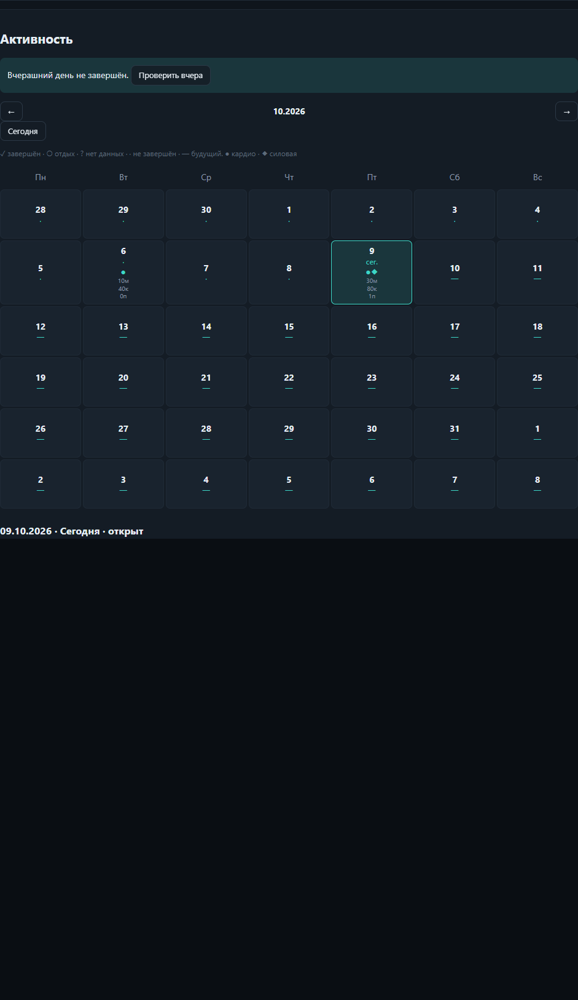
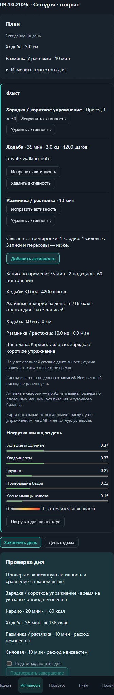
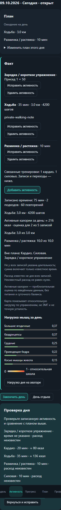
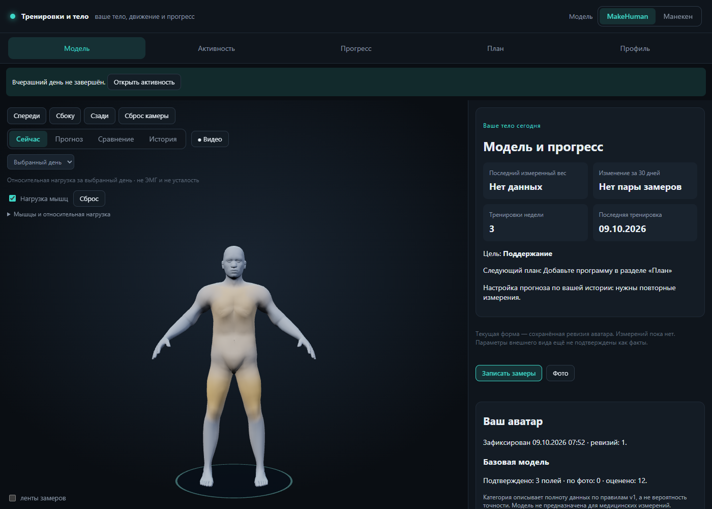

# Phase 3 evidence — 2026-10-09

Implementation tree `365f137659e32d1aa287d134a394d7de846acedc`, published commit `b64b6c4c79d425226dc7fe4f56d5628915af90f4`. Main baseline `6926da7330792eddf0bdbf56bfdc08035e92f06c` (merged #22, CI green).

| Проверка | Результат |
|---|---|
| Release build | 0 warnings / 0 errors |
| .NET | 452/452 |
| JS | 54/54 |
| Browser | activity-day, skeletal, strength, history, forecast, muscle-forecast, product, avatar, avatar-creation, errors — pass |
| Published PWA `/trening/` | offline pass; new walking/Close Day/reload также без сети |
| Viewports | 320/390/1400 px, horizontal overflow отсутствует |
| Backup | exact clean-browser restore, source IDs/closed summaries stable, no duplicates |
| CAS | stale day edit, source mutation after close, post-restore generation rejected |
| #19 compatibility | clean merge-tree `2e4307cec34e932a704eeb6c577a337d79efe6f8`; isolated build 0 warnings/errors; 489/489 .NET; branches not merged |

Synthetic inputs, Windows desktop headless Edge/SwiftShader. [Машинный report](report.json): today 203 ms, switch day 82 ms, add walking 48 ms, confirm close 83 ms, show daily heatmap 136 ms. Это одиночные end-to-end UI timings с automation/render/scroll overhead, не microbenchmark и не физический телефон. Event edits и показ daily heatmap сохраняют UUID текущей 3D-геометрии; existing avatar-creation smoke подтверждает отсутствие функциональной регрессии.

Длинные element captures показывают раздел целиком; fixed mobile navigation присутствует в нижней части изображения. Browser smoke отдельно нажимает подтверждение и проверяет Completed, то есть доступность действия проверена. У заметок тестовые synthetic значения; validation export проверяет их исключение.

CI запускает тот же browser matrix на Linux/Chromium и публикует отдельный `activity-day-evidence` artifact с screenshots, report и synthetic backup/validation zip. Зелёный итог CI проверяется по текущему head PR; актуальная ссылка находится в описании PR.
